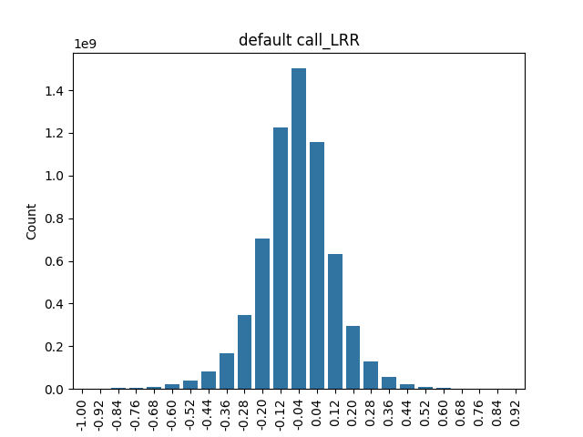
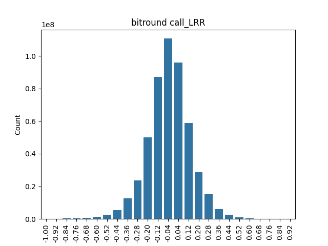
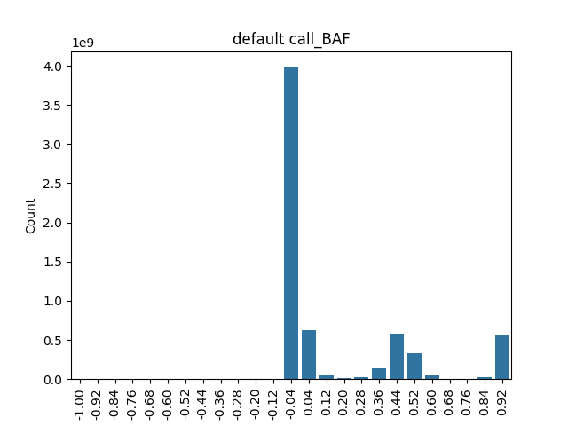
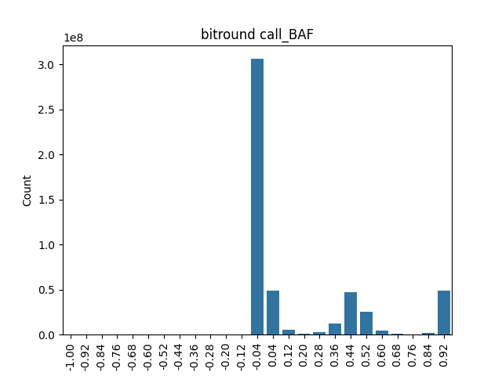
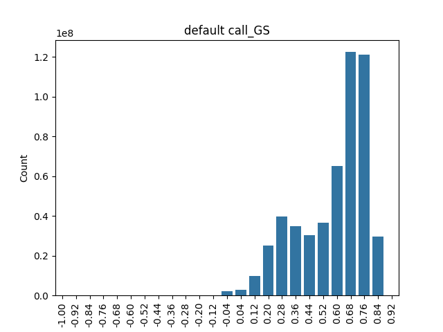
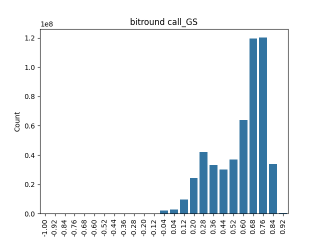
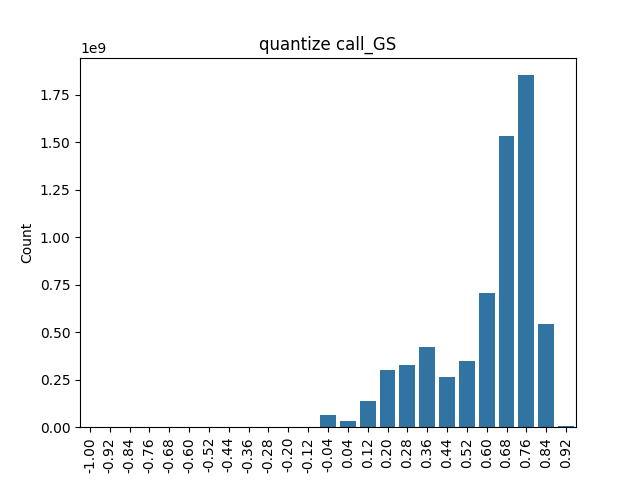

### Info

Chromosome 22 genotype files taken from [release 9](https://ourfuturehealth.gitbook.io/our-future-health/data/data-releases/2024-data-releases/release-9).

- chr 22
- split across three block files
- 10,221 variants
- 651,050 samples

Format fileds of interest
- LRR: Log R Ratio (7 dp float)
- BAF: B allele frequency (7 dp float)
- GS: GenCall Score (4 dp float)


### Transform genotype VCF to column format 

```
INPUT_NAME=xxx

time vcf2zarr explode --force -p 20 -Q ofh.chr22-b0.vcf.gz ofh.chr22-b1.vcf.gz ofh.chr22-b2.vcf.gz $INPUT_NAME.icf

real    8m55.757s
user    138m28.325s
sys     2m36.004s
```

### Make schema

```
vcf2zarr mkschema $INPUT_NAME.icf > $INPUT_NAME.schema.json
```

### Modify schemas

Create two new schemas with filters applied to largest format fields (`call_LRR`, `call_BAF`, `call_GS`)

- quantize filter

```
{
    "id": "quantize",
    "digits": 5,
    "dtype": "<f4",
    "astype": "<f4",
}
```

- bitround filter

```
{
    "id": "bitround", 
    "keepbits": 5
}
```

### Convert to Zarr

- Create Zarr objects for default and using new filters
- Run `vcf2zarr inspect`

```
time vcf2zarr encode --force -p 20 -Q $INPUT_NAME.icf $INPUT_NAME.vcz

real    45m13.790s
user    47m19.185s
sys     2m56.594s

name                   dtype    stored      size           ratio    nchunks  chunk_size    avg_chunk_stored    shape               chunk_shape       compressor
                                filters
---------------------  -------  ----------  ---------  ---------  ---------  ------------  ------------------  ------------------  ----------------  --------------------------------
------------------------------  ------------
/call_LRR              float32  22.16 GiB   24.79 GiB     1.1          1304  19.47 MiB     17.4 MiB            (10221, 651050)     (10000, 1000)     Blosc(cname='zstd', clevel=7, sh
uffle=NOSHUFFLE, blocksize=0)   None
/call_BAF              float32  15.22 GiB   24.79 GiB     1.6          1304  19.47 MiB     11.95 MiB           (10221, 651050)     (10000, 1000)     Blosc(cname='zstd', clevel=7, sh
uffle=NOSHUFFLE, blocksize=0)   None
/call_GS               float32  2.22 GiB    24.79 GiB    11            1304  19.47 MiB     1.74 MiB            (10221, 651050)     (10000, 1000)     Blosc(cname='zstd', clevel=7, sh
uffle=NOSHUFFLE, blocksize=0)   None
/call_genotype         int8     663.97 MiB  12.39 GiB    19            1304  9.73 MiB      521.4 KiB           (10221, 651050, 2)  (10000, 1000, 2)  Blosc(cname='zstd', clevel=7, sh
uffle=BITSHUFFLE, blocksize=0)  None
/call_genotype_mask    bool     84.7 MiB    12.39 GiB   150            1304  9.73 MiB      66.51 KiB           (10221, 651050, 2)  (10000, 1000, 2)  Blosc(cname='zstd', clevel=7, sh
uffle=BITSHUFFLE, blocksize=0)  None
/sample_id             object   3.19 MiB    4.97 MiB      1.6           652  7.8 KiB       5.01 KiB            (651050,)           (1000,)           Blosc(cname='zstd', clevel=7, shuffle=SHUFFLE, blocksize=0)     [VLenUTF8()]
/call_genotype_phased  bool     1.08 MiB    6.2 GiB    5900            1304  4.87 MiB      869 bytes           (10221, 651050)     (10000, 1000)     Blosc(cname='zstd', clevel=7, shuffle=BITSHUFFLE, blocksize=0)  None
/variant_id            object   40.83 KiB   79.85 KiB     2               2  39.93 KiB     20.42 KiB           (10221,)            (10000,)          Blosc(cname='zstd', clevel=7, shuffle=NOSHUFFLE, blocksize=0)   [VLenUTF8()]
/variant_position      int32    39.03 KiB   39.93 KiB     1               2  19.96 KiB     19.52 KiB           (10221,)            (10000,)          Blosc(cname='zstd', clevel=7, shuffle=NOSHUFFLE, blocksize=0)   None
/variant_allele        object   20.71 KiB   159.7 KiB     7.7             2  79.85 KiB     10.35 KiB           (10221, 2)          (10000, 2)        Blosc(cname='zstd', clevel=7, shuffle=NOSHUFFLE, blocksize=0)   [VLenUTF8()]
/variant_filter        bool     12.55 KiB   9.98 KiB      0.8             2  4.99 KiB      6.28 KiB            (10221, 1)          (10000, 1)        Blosc(cname='zstd', clevel=7, shuffle=BITSHUFFLE, blocksize=0)  None
/variant_quality       float32  4.51 KiB    39.93 KiB     8.8             2  19.96 KiB     2.26 KiB            (10221,)            (10000,)          Blosc(cname='zstd', clevel=7, shuffle=NOSHUFFLE, blocksize=0)   None
/variant_contig        int8     4.51 KiB    9.98 KiB      2.2             2  4.99 KiB      2.25 KiB            (10221,)            (10000,)          Blosc(cname='zstd', clevel=7, shuffle=NOSHUFFLE, blocksize=0)   None
/contig_id             object   4.51 KiB    200 bytes     0.043           1  200.0 bytes   4.51 KiB            (25,)               (25,)             Blosc(cname='zstd', clevel=7, shuffle=SHUFFLE, blocksize=0)     [VLenUTF8()]
/variant_id_mask       bool     4.5 KiB     9.98 KiB      2.2             2  4.99 KiB      2.25 KiB            (10221,)            (10000,)          Blosc(cname='zstd', clevel=7, shuffle=BITSHUFFLE, blocksize=0)  None
/contig_length         int64    4.5 KiB     200 bytes     0.043           1  200.0 bytes   4.5 KiB             (25,)               (25,)             Blosc(cname='zstd', clevel=7, shuffle=SHUFFLE, blocksize=0)     None
/filter_id             object   4.43 KiB    8 bytes       0.0018          1  8.0 bytes     4.43 KiB            (1,)                (1,)              Blosc(cname='zstd', clevel=7, shuffle=SHUFFLE, blocksize=0)     [VLenUTF8()]

time vcf2zarr encode --force -p 20 -Qs schema_bitround.json $INPUT_NAME.icf $INPUT_NAME.bitround.vcz

real    100m0.285s
user    103m53.963s
sys     2m49.117s

name                   dtype    stored       size           ratio    nchunks  chunk_size    avg_chunk_stored    shape               chunk_shape       compressor                                                      filters
---------------------  -------  -----------  ---------  ---------  ---------  ------------  ------------------  ------------------  ----------------  -------------------------------
-------------------------------  ----------------------
/call_LRR              float32  8.41 GiB     24.79 GiB     2.9          1304  19.47 MiB     6.61 MiB            (10221, 651050)     (10000, 1000)     Blosc(cname='zstd', clevel=7, s
huffle=NOSHUFFLE, blocksize=0)   [BitRound(keepbits=5)]
/call_BAF              float32  6.14 GiB     24.79 GiB     4            1304  19.47 MiB     4.82 MiB            (10221, 651050)     (10000, 1000)     Blosc(cname='zstd', clevel=7, s
huffle=NOSHUFFLE, blocksize=0)   [BitRound(keepbits=5)]
/call_GS               float32  1021.24 MiB  24.79 GiB    25            1304  19.47 MiB     801.95 KiB          (10221, 651050)     (10000, 1000)     Blosc(cname='zstd', clevel=7, s
huffle=NOSHUFFLE, blocksize=0)   [BitRound(keepbits=5)]
/call_genotype         int8     663.97 MiB   12.39 GiB    19            1304  9.73 MiB      521.4 KiB           (10221, 651050, 2)  (10000, 1000, 2)  Blosc(cname='zstd', clevel=7, s
huffle=BITSHUFFLE, blocksize=0)  None
/call_genotype_mask    bool     84.7 MiB     12.39 GiB   150            1304  9.73 MiB      66.51 KiB           (10221, 651050, 2)  (10000, 1000, 2)  Blosc(cname='zstd', clevel=7, s
huffle=BITSHUFFLE, blocksize=0)  None
/sample_id             object   3.19 MiB     4.97 MiB      1.6           652  7.8 KiB       5.01 KiB            (651050,)           (1000,)           Blosc(cname='zstd', clevel=7, s
huffle=SHUFFLE, blocksize=0)     [VLenUTF8()]
/call_genotype_phased  bool     1.08 MiB     6.2 GiB    5900            1304  4.87 MiB      869 bytes           (10221, 651050)     (10000, 1000)     Blosc(cname='zstd', clevel=7, s
huffle=BITSHUFFLE, blocksize=0)  None
/variant_id            object   40.83 KiB    79.85 KiB     2               2  39.93 KiB     20.42 KiB           (10221,)            (10000,)          Blosc(cname='zstd', clevel=7, s
huffle=NOSHUFFLE, blocksize=0)   [VLenUTF8()]
/variant_position      int32    39.03 KiB    39.93 KiB     1               2  19.96 KiB     19.52 KiB           (10221,)            (10000,)          Blosc(cname='zstd', clevel=7, s
huffle=NOSHUFFLE, blocksize=0)   None
/variant_allele        object   20.71 KiB    159.7 KiB     7.7             2  79.85 KiB     10.35 KiB           (10221, 2)          (10000, 2)        Blosc(cname='zstd', clevel=7, s
huffle=NOSHUFFLE, blocksize=0)   [VLenUTF8()]
/variant_filter        bool     12.55 KiB    9.98 KiB      0.8             2  4.99 KiB      6.28 KiB            (10221, 1)          (10000, 1)        Blosc(cname='zstd', clevel=7, s
huffle=BITSHUFFLE, blocksize=0)  None
/variant_quality       float32  4.51 KiB     39.93 KiB     8.8             2  19.96 KiB     2.26 KiB            (10221,)            (10000,)          Blosc(cname='zstd', clevel=7, s
huffle=NOSHUFFLE, blocksize=0)   None
/variant_contig        int8     4.51 KiB     9.98 KiB      2.2             2  4.99 KiB      2.25 KiB            (10221,)            (10000,)          Blosc(cname='zstd', clevel=7, s
huffle=NOSHUFFLE, blocksize=0)   None
/contig_id             object   4.51 KiB     200 bytes     0.043           1  200.0 bytes   4.51 KiB            (25,)               (25,)             Blosc(cname='zstd', clevel=7, s
huffle=SHUFFLE, blocksize=0)     [VLenUTF8()]
/variant_id_mask       bool     4.5 KiB      9.98 KiB      2.2             2  4.99 KiB      2.25 KiB            (10221,)            (10000,)          Blosc(cname='zstd', clevel=7, s
huffle=BITSHUFFLE, blocksize=0)  None
/contig_length         int64    4.5 KiB      200 bytes     0.043           1  200.0 bytes   4.5 KiB             (25,)               (25,)             Blosc(cname='zstd', clevel=7, s
huffle=SHUFFLE, blocksize=0)     None
/filter_id             object   4.43 KiB     8 bytes       0.0018          1  8.0 bytes     4.43 KiB            (1,)                (1,)              Blosc(cname='zstd', clevel=7, s
huffle=SHUFFLE, blocksize=0)     [VLenUTF8()]

time vcf2zarr encode --force -p 20 -Qs schema_quantize.json $INPUT_NAME.icf $INPUT_NAME.quantize.vcz

real    57m27.351s
user    59m56.832s
sys     3m31.366s

name                   dtype    stored      size           ratio    nchunks  chunk_size    avg_chunk_stored    shape               chunk_shape       compressor
                                filters
---------------------  -------  ----------  ---------  ---------  ---------  ------------  ------------------  ------------------  ----------------  --------------------------------
------------------------------  ---------------------------------
/call_LRR              float32  16.4 GiB    24.79 GiB     1.5          1304  19.47 MiB     12.88 MiB           (10221, 651050)     (10000, 1000)     Blosc(cname='zstd', clevel=7, sh
uffle=NOSHUFFLE, blocksize=0)   [Quantize(digits=5, dtype='<f4')]
/call_BAF              float32  11.47 GiB   24.79 GiB     2.2          1304  19.47 MiB     9.01 MiB            (10221, 651050)     (10000, 1000)     Blosc(cname='zstd', clevel=7, sh
uffle=NOSHUFFLE, blocksize=0)   [Quantize(digits=5, dtype='<f4')]
/call_GS               float32  1.93 GiB    24.79 GiB    13            1304  19.47 MiB     1.52 MiB            (10221, 651050)     (10000, 1000)     Blosc(cname='zstd', clevel=7, sh
uffle=NOSHUFFLE, blocksize=0)   [Quantize(digits=5, dtype='<f4')]
/call_genotype         int8     663.97 MiB  12.39 GiB    19            1304  9.73 MiB      521.4 KiB           (10221, 651050, 2)  (10000, 1000, 2)  Blosc(cname='zstd', clevel=7, sh
uffle=BITSHUFFLE, blocksize=0)  None
/call_genotype_mask    bool     84.7 MiB    12.39 GiB   150            1304  9.73 MiB      66.51 KiB           (10221, 651050, 2)  (10000, 1000, 2)  Blosc(cname='zstd', clevel=7, sh
uffle=BITSHUFFLE, blocksize=0)  None
/sample_id             object   3.19 MiB    4.97 MiB      1.6           652  7.8 KiB       5.01 KiB            (651050,)           (1000,)           Blosc(cname='zstd', clevel=7, sh
uffle=SHUFFLE, blocksize=0)     [VLenUTF8()]
/call_genotype_phased  bool     1.08 MiB    6.2 GiB    5900            1304  4.87 MiB      869 bytes           (10221, 651050)     (10000, 1000)     Blosc(cname='zstd', clevel=7, sh
uffle=BITSHUFFLE, blocksize=0)  None
/variant_id            object   40.83 KiB   79.85 KiB     2               2  39.93 KiB     20.42 KiB           (10221,)            (10000,)          Blosc(cname='zstd', clevel=7, sh
uffle=NOSHUFFLE, blocksize=0)   [VLenUTF8()]
/variant_position      int32    39.03 KiB   39.93 KiB     1               2  19.96 KiB     19.52 KiB           (10221,)            (10000,)          Blosc(cname='zstd', clevel=7, sh
uffle=NOSHUFFLE, blocksize=0)   None
/variant_allele        object   20.71 KiB   159.7 KiB     7.7             2  79.85 KiB     10.35 KiB           (10221, 2)          (10000, 2)        Blosc(cname='zstd', clevel=7, sh
uffle=NOSHUFFLE, blocksize=0)   [VLenUTF8()]
/variant_filter        bool     12.55 KiB   9.98 KiB      0.8             2  4.99 KiB      6.28 KiB            (10221, 1)          (10000, 1)        Blosc(cname='zstd', clevel=7, sh
uffle=BITSHUFFLE, blocksize=0)  None
/variant_quality       float32  4.51 KiB    39.93 KiB     8.8             2  19.96 KiB     2.26 KiB            (10221,)            (10000,)          Blosc(cname='zstd', clevel=7, sh
uffle=NOSHUFFLE, blocksize=0)   None
/variant_contig        int8     4.51 KiB    9.98 KiB      2.2             2  4.99 KiB      2.25 KiB            (10221,)            (10000,)          Blosc(cname='zstd', clevel=7, sh
uffle=NOSHUFFLE, blocksize=0)   None
/contig_id             object   4.51 KiB    200 bytes     0.043           1  200.0 bytes   4.51 KiB            (25,)               (25,)             Blosc(cname='zstd', clevel=7, sh
uffle=SHUFFLE, blocksize=0)     [VLenUTF8()]
/variant_id_mask       bool     4.5 KiB     9.98 KiB      2.2             2  4.99 KiB      2.25 KiB            (10221,)            (10000,)          Blosc(cname='zstd', clevel=7, sh
uffle=BITSHUFFLE, blocksize=0)  None
/contig_length         int64    4.5 KiB     200 bytes     0.043           1  200.0 bytes   4.5 KiB             (25,)               (25,)             Blosc(cname='zstd', clevel=7, sh
uffle=SHUFFLE, blocksize=0)     None
/filter_id             object   4.43 KiB    8 bytes       0.0018          1  8.0 bytes     4.43 KiB            (1,)                (1,)              Blosc(cname='zstd', clevel=7, sh
uffle=SHUFFLE, blocksize=0)     [VLenUTF8()]
```

- each `.vcz` also has a CSV file created via `vcf2zarr inspect` in the `csvs` directory

### Compare data sizes

```
20G	    ofh.chr22-b0.vcf.gz
19G	    ofh.chr22-b1.vcf.gz
3.3G    ofh.chr22-b2.vcf.gz
41G	    ofh.chr22.icf
41G	    ofh.chr22.vcz
17G	    ofh.chr22.bitround.vcz
31G     ofh.chr22.quantize.vcz
```

### Compare distributions 

Compare default and filteed values via histograms of each format field

- call_LRR





- call_BAF





- call_GS





### Calculate Mean Absolute Error

Look at the mean absolute error by comparing default vs filtered for each format field

```
import sgkit
import dask.array as da

format_fields = ["call_LRR", "call_BAF", "call_GS"]

ds_1 = sgkit.load_dataset(zarr_path1)
ds_2 = sgkit.load_dataset(zarr_path2)

for format_field in format_fields:
    z1 = ds_1[format_field]
    z2 = ds_2[format_field]
    mae = da.nanmean(da.abs(z1 - z2)).compute()
```

| format field | filter type | mae | 
| --- | --- |  --- |
| call_LRR | bitround | 0.0006934664561413229 |
| call_BAF | bitround | 0.0007864997605793178 |
| call_GS | bitround | 0.003377074608579278 |
| call_LRR | quantize | 1.907108071463881e-06 |
| call_BAF | quantize | 1.1768814829338226e-06 |
| call_GS | quantize | 1.8836773278962937e-06 |
